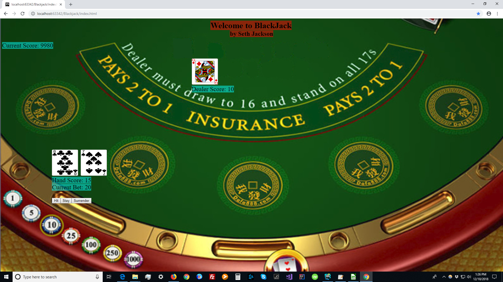

# Blackjack
A Web Application written in Typescript that allows the user to play Blackjack.

## How to use
Run the file index.html in a web browser such as Google Chrome, Mozilla Firefox, or Microsoft Edge.

## Game rules
The goal of the game is to get the point value of your hand as close to 21 as possible without going over. If you get closer than the dealer, then you win.

If the player gets over 21 their turn ends immediately and they lose.

If a player gets 21 on their first hand, then they get blackjack and win 50% more than they normally would.
If the player and dealer get blackjack at the same time, the player loses.

## Player Options

Hit - player gets another card

Stay - ends the player's turn for that hand

Split - If the player has two cards with the same point value, they can split their hand into two seperate hands. The bet on the second hand is the same as the first

Insurance - If the dealer's first card is an ace, the player can pay an amount equal to half of their current bet to insure their hand. If they do so and the dealer gets blackjack, then the player won't lose any score for that hand

Double Down - Player doubles their bet, draws one card, and ends their turn. This can be done only if their starting score is less than 11

Surrender - Player gives up and loses half of their bet  
